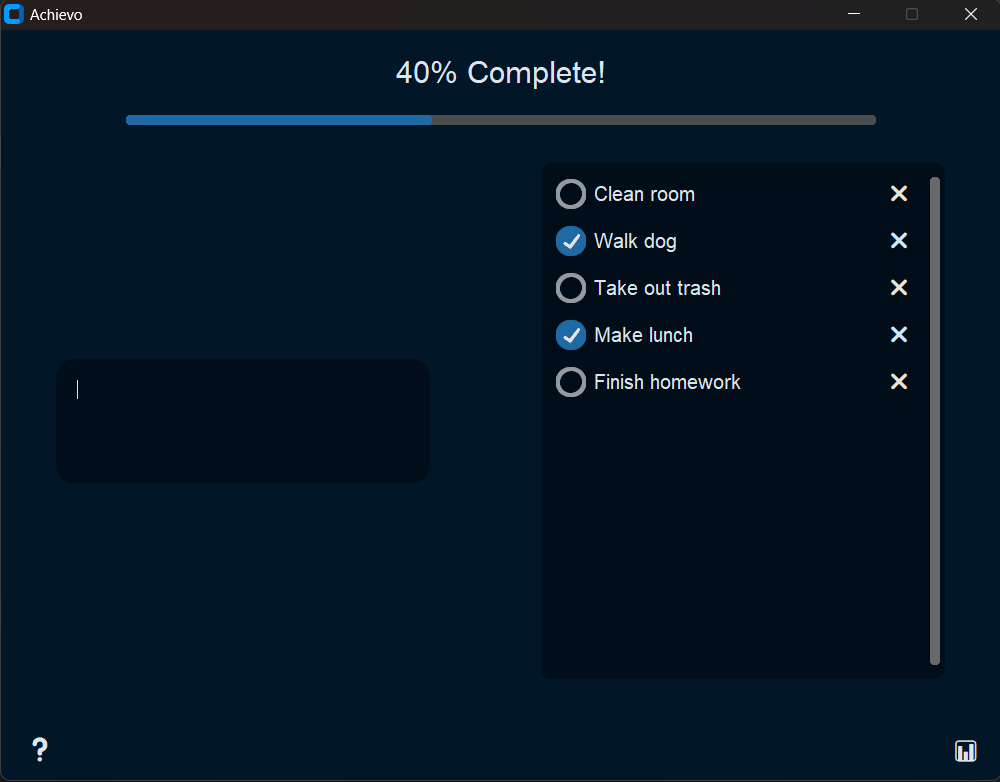

# Achievo

### Purpose:
These days even "simple" ToDo applications are no longer simple. They're far too overengineered and 
sometimes a headache to keep up with. Achievo is my own attempt at the classic ToDo List project,
and I made it with simplicity at the forefront. The main user interface is made with CustomTkinter[^1] and with a basic class heirarchy. In a future update, a new data visualization feature will be made to view your progress on goal completition. 

    

---

### Setup:
Instructions on how to create executable .exe are coming soon, however for now the application must be opened through the terminal. 

`git clone https://github.com/UMD-Mehdiyev/Achievo.git` to clone the project

`cd src` to navigate into where the Main file lies

`python Main.py` to start the application

[^1]: [CustomTkinter](https://github.com/tomschimansky/customtkinter) is a modern and customizable python UI-library based on Tkinter
